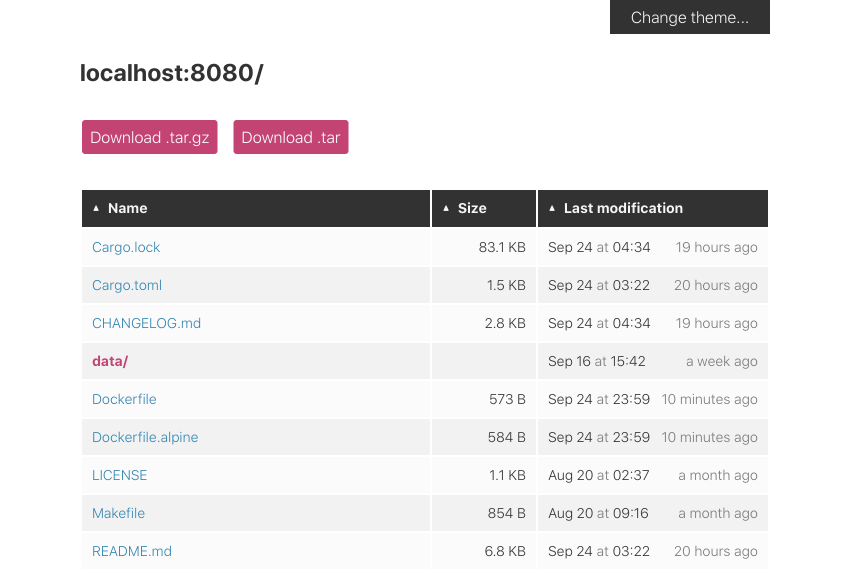

# miniserve - a CLI tool to serve files and dirs over HTTP

**For when you really just want to serve some files over HTTP right now!**

**miniserve** is a small, self-contained cross-platform CLI tool that allows you to just grab the binary and serve some file(s) via HTTP.
Sometimes this is just a more practical and quick way than doing things properly.

## Screenshot

## How to use

### Serve a directory:

    miniserve linux-distro-collection/

### Serve a single file:

    miniserve linux-distro.iso

### Require username/password:

    miniserve --auth joe:123 unreleased-linux-distros/

### Generate random 6-hexdigit URL:

    miniserve -i 192.168.0.1 --random-route /tmp
    # Serving path /private/tmp at http://192.168.0.1/c789b6

### Bind to multiple interfaces:

    miniserve -i 192.168.0.1 -i 10.13.37.10 -i ::1 /tmp/myshare

## Features

- Easy to use
- Just works: Correct MIME types handling out of the box
- Single binary drop-in with no extra dependencies required
- Authentication support with username and password (and hashed password)
- Mega fast and highly parallel (thanks to [Rust](https://www.rust-lang.org/) and [Actix](https://actix.rs/))
- Folder download (compressed on the fly as `.tar.gz` or `.zip`)
- File uploading
- Pretty themes

## How to install

**On Linux**: Download `miniserve-linux` from [the releases page](https://github.com/svenstaro/miniserve/releases) and run

    chmod +x miniserve-linux
    ./miniserve-linux

**On OSX**: Download `miniserve-osx` from [the releases page](https://github.com/svenstaro/miniserve/releases) and run

    chmod +x miniserve-osx
    ./miniserve-osx

Alternatively install with [Homebrew](https://brew.sh/).

    brew install miniserve
    miniserve

**On Windows**: Download `miniserve-win.exe` from [the releases page](https://github.com/svenstaro/miniserve/releases) and run

    miniserve-win.exe

**With Cargo**: You will need the _nightly_ version of Rust to compile the project. Then you can run

    cargo install miniserve
    miniserve

**With Docker:** If you prefer using Docker for this, run

    docker run -v /tmp:/tmp -p 8080:8080 --rm -it svenstaro/miniserve /tmp

## Binding behavior

For convenience reasons, miniserve will try to bind on all interfaces by default (if no `-i` is provided).
It will also do that if explicitly provided with `-i 0.0.0.0` or `-i ::`.
In all of the aforementioned cases, it will bind on both IPv4 and IPv6.
If provided with an explicit non-default interface, it will ONLY bind to that interface.
You can provide `-i` multiple times to bind to multiple interfaces at the same time.

## Why use this over alternatives?

- darkhttpd: Not easily available on Windows and it's not as easy as download and go.
- Python built-in webserver: Need to have Python installed, it's low performance, and also doesn't do correct MIME type handling in some cases.
- netcat: Not as convenient to use and sending directories is [somewhat involved](https://nakkaya.com/2009/04/15/using-netcat-for-file-transfers/).

## Releasing

This is mostly a note for me on how to release this thing:

- Update version in `Cargo.toml` and run `cargo update`.
- `git commit` and `git tag -s`, `git push`.
- `cargo publish`
- Releases will automatically be deployed by Travis.
- Update AUR package.
